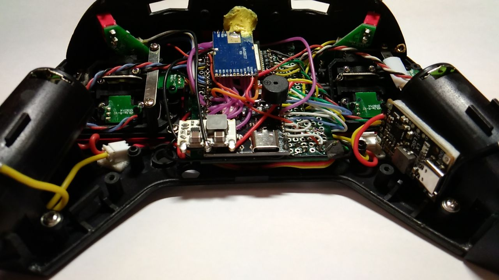

ESP32-S3 based ExpressLRS Handset.

Do not use ESP32-S3 with Octal SPI PSRAM, due to it occupies GPIO35~37
Use target Unified_ESP32_2400_TX_via_UART

Choose one of the
2) RunCam ESP32-S3 E28 TX
3) RunCam ESP32-S3 F27 TX
configuration to load into the firmware file

for auto choose in file UnifiedConfiguration.py set proper number to
101:     choice = 3	#input()
or leave as is
101:	choice = input()

##### Some photos

