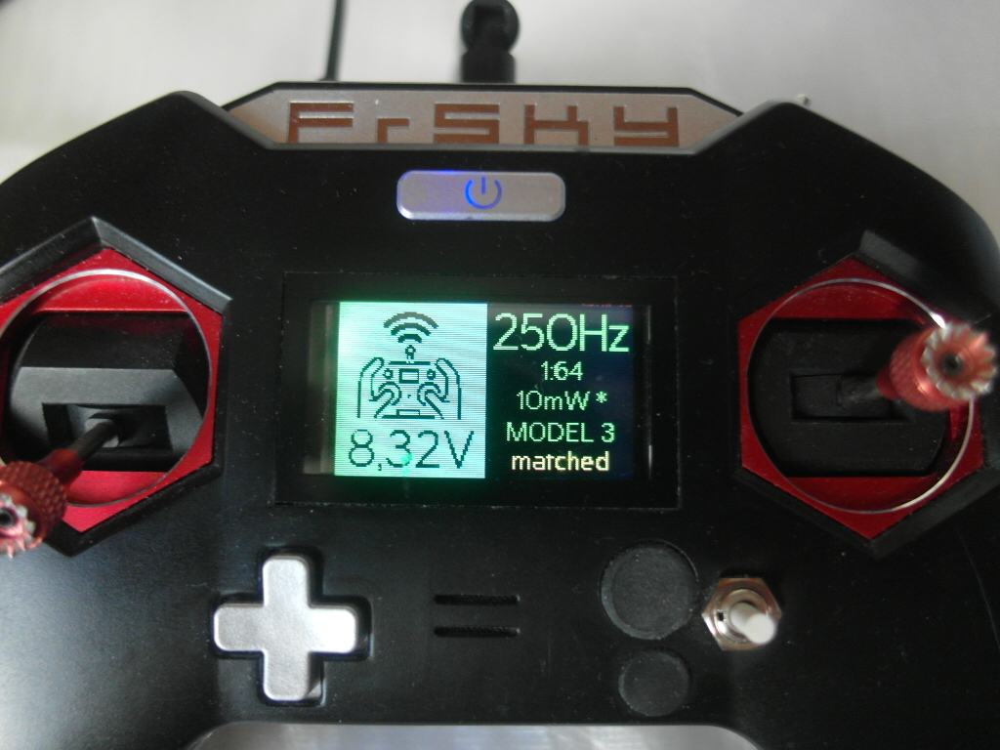
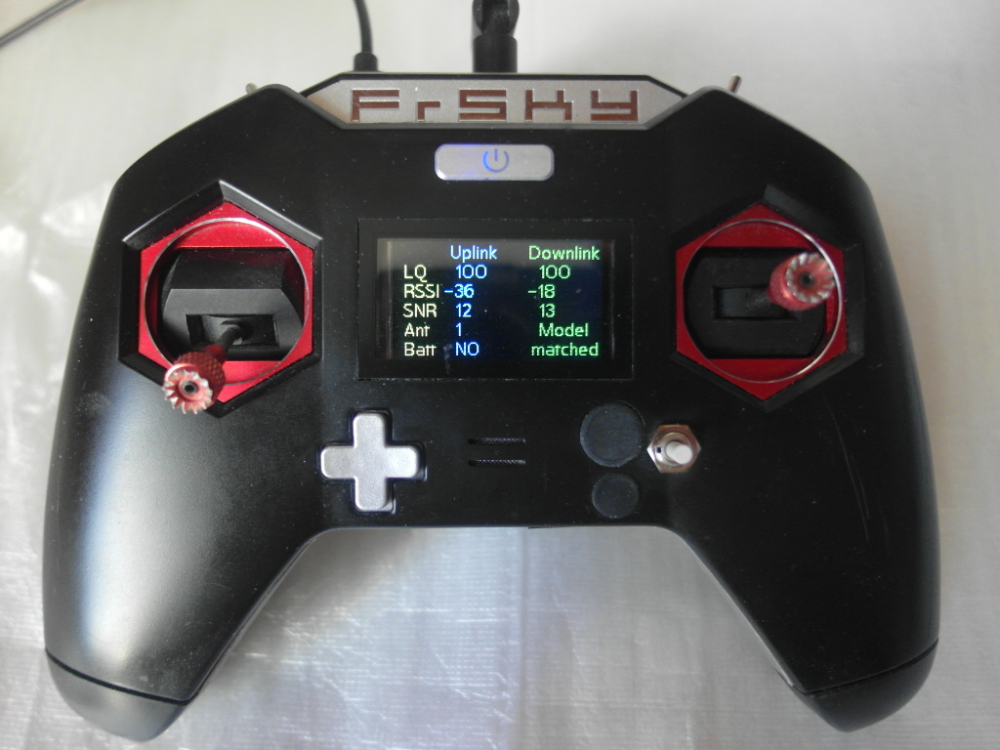
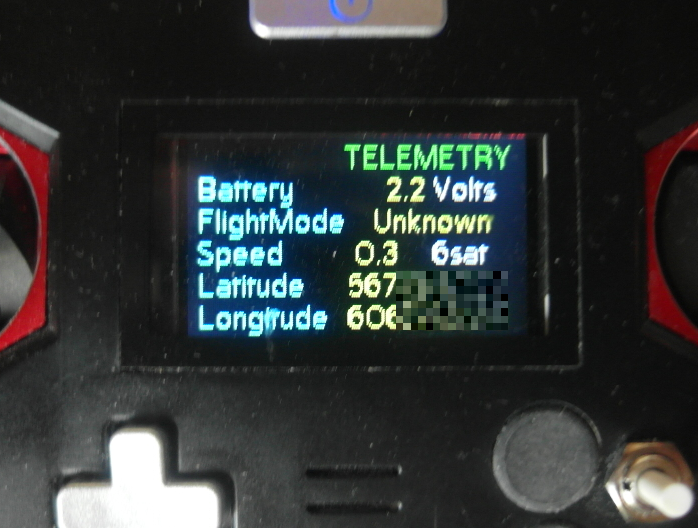
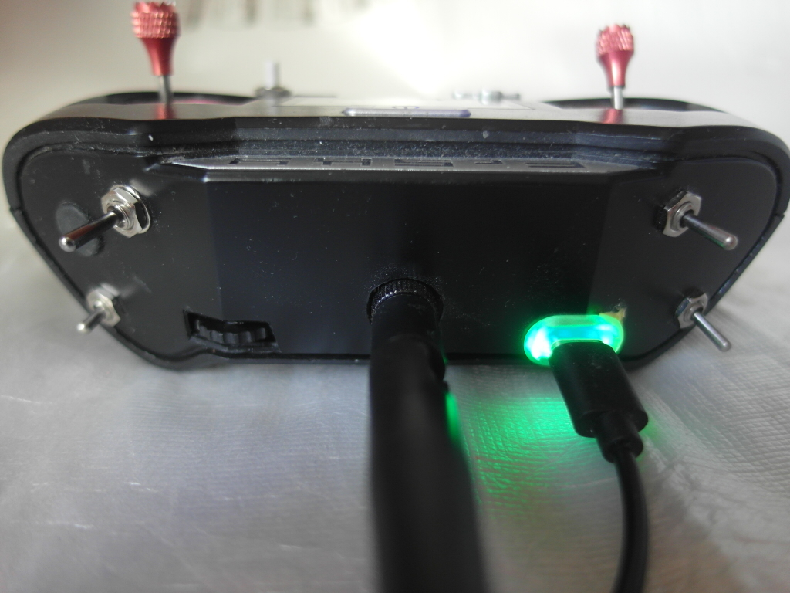

4.0.0-S3-xLite firmware is ESP32-S3 based [ExpressLRS](https://github.com/ExpressLRS/ExpressLRS/releases) Handset . 
Applied gimbal calibration, model matching and all regular "Tx Module" menu options,
 Link Quality, Telemetry and raw calibrated values screen, auto screen off when Armed
 and buzzer notification Rx battery Low, based on model number divider.
Tested with G-NiceRF LORA1280F27-TCXO, ESP32-S3 Development Board N8R2
(do not use ESP32-S3 with Octal SPI PSRAM, due to it occupies GPIO33~37). 
Also WeAct S3 ESP32S3-H4R2-MINI board allows utilise additional GPIO33 and GPIO34 for another encoder or 3-position switch.

Build "Unified_ESP32_S3_2400_TX_Via_UART" target, choose "CoreWing Sirius 2.4GHz TX" configuration.
Due to CoreWing 2400.json, GPIO18 is ADC battery pin, GPIO15, 16(instead of right 3-position switch) and 6(button) - rotary encoder,
 GPIO43(backpackTx) connected to pin 3 ESP32-C3-SuperMini,
 flashed with [BLE Telemetry Lite](https://github.com/BushlanovDev/ble-telemetry-lite/releases),
 that gives support [TelemetryViewer](https://github.com/RomanLut/android-taranis-smartport-telemetry/releases). 
Encoder(SIQ-02FVS3) has 32 rotation click entire ch8 range, button double click returns it to the middle position. 
Also encoder button switches ch9 "Button Left", as well as GPIO7 ch10 "Button Right". 
Other ADC(ch1-ch4), swithes(ch5-ch7) are described in lib/ADC/devADC.cpp, power and buzzer behavior in lib/AnalogVbat/devAnalogVbat.cpp.
Arming not allowed when receiver not connected(and model matched) or throttle not at zero position.
In lib/SCREEN/TFT/tftdisplay.cpp implemented some color/size tricks for ST7735S(blue board) 160x128 display.

4.0.0-S3-NV3023(in progress) the same for NV3023 2.08" display and more proper ADC(ch1-ch4) order.

For 3.6.0-S3-F27 use target Unified_ESP32S3_2400_TX_via_UART.
Choose one of the 2) RunCam ESP32-S3 E28 TX, or 3) RunCam ESP32-S3 F27 TX 
configuration to load into the firmware file.

For auto choose in file UnifiedConfiguration.py set proper number to
101:     choice = 3	#input()
or leave as is
101:	choice = input()

##### Some photos

